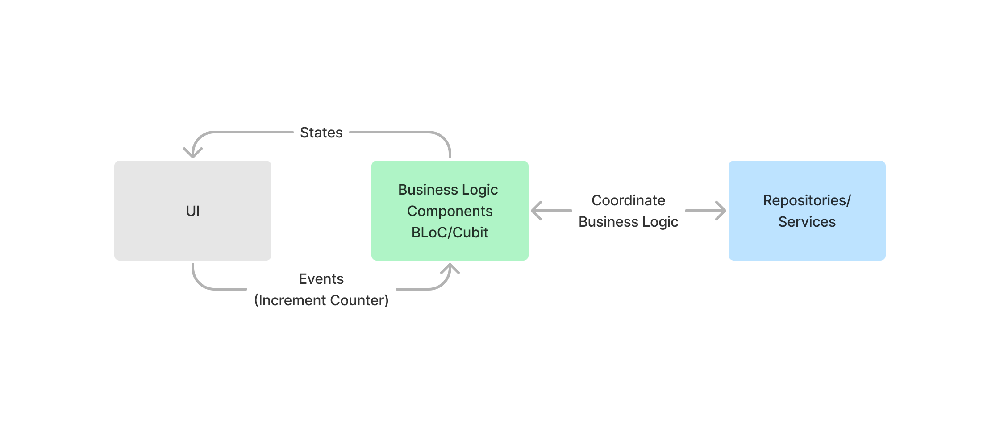

# BLoC Blazor

### Overview

This package aims to implement Business Logic Component (BLoC) Design Pattern for Handling State Changes. This package
is inspired from the Dart package https://pub.dev/packages/flutter_bloc

### What This Package Aims To Solve

* Listen To State Changes
* Share UI State Across Multiple Components
* Reduces UI Rebuilds Overhead by Calling StateHasChanged When Suits when there's no User Action
* Organize Code by Separating Business Logic from the UI Components
* Provides a Design Pattern For Developers that Handles Most Complex Scenarios

### About The Design Pattern



### Classes/Interfaces

* **States**
    * Class responsible for holding data that is expected to be changed by User/System Events
* **BLoC/Cubit**
    * Class responsible for Coordinating the User/System Events to Produce New States
* **Events**
    * BLoC/Cubit Class Methods that can be triggered/called to execute the Business Logic in order to mutate the State
* **BLoCBuilder**
    * Class responsible to wrap both the BLoC and State in order to be shared and listened to
* **BlocListener Component**
    * Razor component that simplifies listening to changes

### How To Use

#### Setup
Add the required dependencies into your Project
```
  dotnet add package Vaygeth.Bloc
  dotnet add package Vaygeth.Bloc.Blazor
```

#### Creating State Class
Create the class that will hold the data. In this example we will use Counter example
```csharp

public record CountState(int Count = 0) : BlocState;

```

#### Creating BLoC/Cubit Class

```csharp

public class CountCubit : Cubit<CountState>
{
    public CountCubit() : base(new CountState())
    {
    }

    public void Increment()
    {
        int currentCount = State.Count;
        Emit(new CountState(currentCount + 1));
    }

    public void Decrement()
    {
        int currentCount = State.Count;
        if (currentCount > 0)
        {
            Emit(new CountState(currentCount - 1));
        }
    }
}

```

#### Injecting BLocBuilder

#### Program.cs
```csharp
    var builder = WebAssemblyHostBuilder.CreateDefault(args);
    // rest of the code....
    // ...

    builder.Services.AddScoped(sp => new BlocBuilder<CountCubit, CountState>(new CountCubit()));
    // rest of the code....
    // ...

    await builder.Build().RunAsync();
```

#### Using BLocBuilder
Inject your builder in your component specifying the the BLoC/Cubit and State

```csharp
    [Inject]
    private BlocBuilder<CountCubit, CountState> Builder { get; set; }
```


#### Using BlocListener

### Disclosure & Notes

As if now the package is in early release, and enhancements is still required


